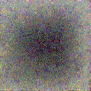

# CLIP Guided Diffusion

[](https://gitter.im/clip-guided-diffusion/community?utm_source=badge&utm_medium=badge&utm_campaign=pr-badge&utm_content=badge)

From [RiversHaveWings](https://twitter.com/RiversHaveWings).

Generate vibrant and detailed images using only text.

</img></img></img>
</img></img></img>

See captions and more generations in the [Gallery](/images/README.md)

See also - <a href="https://github.com/nerdyrodent/VQGAN-CLIP">VQGAN-CLIP</a>

> This code is currently under active development and is subject to frequent changes. Please file an issue if you have any constructive feedback, questions, or issues with the code or colab notebook.
> Windows user? Please file an issue if you have any issues with the code. I have no way to test that platform currently but would like to try.

## Install

```sh
git clone https://github.com/afiaka87/clip-guided-diffusion.git && cd clip-guided-diffusion
git clone https://github.com/afiaka87/guided-diffusion.git
pip3 install -e guided-diffusion
python3 setup.py install
```

## Run

`cgd -txt "Alien friend by Odilon Redo"`

A gif of the full run will be saved to `./outputs/caption_{j}.gif` by default.



- `current.png` will contain the current generation.
- `./outputs` will contain all intermediate outputs
- `~/.cache/clip-guided-diffusion/` will contain downloaded checkpoints from OpenAI/Katherine Crowson.

## Usage - CLI

### Text to image generation

`--prompts` / `-txts`
`--image_size` / `-size`

`cgd --image_size 256 --prompts "32K HUHD Mushroom"`


### Text to image generation (multiple prompts with weights)

- multiple prompts can be specified with the `|` character.
- you may optionally specify a weight for each prompt using a `:` character.
- e.g. `cgd --image_size 256 --prompts "Noun to visualize:1.0|style:0.1|location:0.1|something you dont want:-0.1"`
- weights must not sum to 0

### CPU

- **Using a CPU can take a very long time** compared to using cuda. In many cases it won't be feasible to complete a full generation.
- If you have a relatively recent CPU, you can run the following command to generate a single image in 30 minutes to several hours, depending on your CPU.
- Note: in order to decrease runtime significantly, this uses "ddim50", the "cosine" scheduler and the 64x64 checkpoint. Generations may be somewhat underwhelming. Increase `-respace` or `-size` at your own risk.

`cgd --device cpu --prompt "You can use the short options too." -cutn 8 -size 64 -cgs 5 -tvs 0.00001 -respace "ddim50" -clip "ViT-B/32"`

### CUDA GPU

`cgd --prompt "Theres no need to specify a device, it will be chosen automatically" -cutn 32 -size 256`

### Iterations/Steps (Timestep Respacing)

`--timestep_respacing` or `-respace` (default: `1000`)
- Use fewer timesteps over the same diffusion schedule. Sacrifices accuracy/alignment for improved speed.
- options: - `25`, `50`, `150`, `250`, `500`, `1000`, `ddim25`,`ddim50`,`ddim150`, `ddim250`,`ddim500`,`ddim1000`

`cgd -respace 'ddim50' -txt "cat painting"`

</img>

### Existing image

The following three paramaters are required to generate an image using an existing image:

**You must supply at least `--init_image` and `--skip_timesteps` when supplying an initial image.**

#### `--init_image`/`-init`

- Blend an image with the diffusion for a number of steps.

#### `--skip_timesteps`/`-skip`

The number of timesteps to spend blending the image with the guided-diffusion samples.
Must be less than `--timestep_respacing` and greater than 0.
Good values using timestep_respacing of 1000 are 250 to 500.

- `-respace 1000 -skip 500`
- `-respace 500 -skip 250`
- `-respace 250 -skip 125`
- `-respace 125 -skip 75`
- `-respace "ddim50" -skip 25`

#### `--init_scale`/`-is`

To enable a VGG perceptual loss after the blending, you must specify an `--init_scale` value. 1000 seems to work well.

```sh
cgd --prompts "A mushroom in the style of Vincent Van Gogh" \
  --timestep_respacing 1000 \
  --init_image "images/32K_HUHD_Mushroom.png" \
  --init_scale 1000 \
  --skip_timesteps 350
```

</img>

### Image size

Increase in `-size` has drastic impacts on performance. `128` is used by default.
- options: `64, 128, 256, 512 pixels (square)`
- `--clip_guidance_scale` and `--tv_scale` will require experimentation.
- **Note about 64x64** when using the 64x64 checkpoint, the cosine noise scheduler is used. For unclear reasons, this noise scheduler requires different values for `--clip_guidance_scale` and `--tv_scale`. I recommend starting with `-cgs 5 -tvs 0.00001` and experimenting from around there.
- For all other checkpoints, clip_guidance_scale seems to work well around 1000-2000 and tv_scale at 0, 100, 150 or 200
```sh
cgd --init_image=images/32K_HUHD_Mushroom.png \
    --skip_timesteps=500 \
    --image_size 64 \
    --prompt "8K HUHD Mushroom"
```

</img>
_resized to 128 pixels for visibility_

```sh
cgd --image_size 512 --prompt "8K HUHD Mushroom"
```

</img>
_resized to 320 pixels for formatting_

## Usage - Python

```python
# Initialize diffusion generator
from cgd import clip_guided_diffusion
import cgd_util
import kornia.augmentation as K

prompt = "An image of a fox in a forest."

cgd_generator = clip_guided_diffusion(
    prompts="an image of a fox in a forest",
    image_prompts="image_to_compare_with_clip.png",
    batch_size=1,
    clip_guidance_scale=1500,
    tv_scale=150,
    init_scale=1000,
    range_scale=50,
    image_size=256,
    class_cond=False,
    randomize_class=False, # only works with class conditioned checkpoints
    num_classes=0, # 0 uses all 1000 classes; only works with class conditioned checkpoints
    cutout_power=0.5,
    num_cutouts=64,
    timestep_respacing="1000",
    seed=0,
    diffusion_steps=1000, # dont change this
    skip_timesteps=400,
    init_image="image_to_blend_and_compare_with_vgg.png",
    clip_model_name="ViT-B/16",
    dropout=0.0,
    device="cuda",
    augs=[
      K.RandomAffine(degrees=0, translate=(0.1, 0.1), scale=(0.9, 1.1), shear=0.1)),
      K.RandomMotionBlur(kernel_size=(1, 5), angle=15, direction=0.5)),
      K.RandomHorizontalFlip(p=0.5)),
    ],
)
prefix_path.mkdir(exist_ok=True)
list(enumerate(tqdm(cgd_generator))) # iterate over generator
for batch_idx in range(args.batch_size):
    cgd_util.create_gif(base=prefix_path,prompts=prompts, batch_idx=batch_idx) # create gifs for each gen in batch
```

(WIP) - Generate an image for each prompt in a line-separated text file.

```python
def vis_prompts_from_file(prompts_filename, **kwargs):
    """
    Run the generator for multiple prompts provided as a txt file
    """
    prompts_path = Path(prompts_filename)
    if not prompts_path.exists():
        print(f"{prompts_path} does not exist.")
        return
    with open(prompts_path, "r") as f:
        prompts = f.readlines()

    for prompt in prompts:
        prompt = prompt.strip()
        if prompt == "":
            continue
        print(f"Running for prompt '{prompt}'")
        cgd_generator = clip_guided_diffusion(prompts=prompt, **kwargs)
        list(enumerate(tqdm(cgd_generator))) # iterate over generator
```


## Full Usage

```sh
usage: cgd [-h] [--prompts PROMPTS] [--image_prompts IMAGE_PROMPTS]
           [--image_size IMAGE_SIZE] [--init_image INIT_IMAGE]
           [--init_scale INIT_SCALE] [--skip_timesteps SKIP_TIMESTEPS]
           [--prefix PREFIX] [--checkpoints_dir CHECKPOINTS_DIR]
           [--batch_size BATCH_SIZE]
           [--clip_guidance_scale CLIP_GUIDANCE_SCALE] [--tv_scale TV_SCALE]
           [--range_scale RANGE_SCALE] [--seed SEED]
           [--save_frequency SAVE_FREQUENCY]
           [--diffusion_steps DIFFUSION_STEPS]
           [--timestep_respacing TIMESTEP_RESPACING]
           [--num_cutouts NUM_CUTOUTS] [--cutout_power CUTOUT_POWER]
           [--clip_model CLIP_MODEL] [--uncond]
           [--noise_schedule NOISE_SCHEDULE] [--dropout DROPOUT]
           [--max_classes MAX_CLASSES] [--device DEVICE] [--random_affine]
           [--random_motion_blur] [--random_horizontal_flip]

optional arguments:
  -h, --help            show this help message and exit
  --prompts PROMPTS, -txts PROMPTS
                        the prompt/s to reward paired with weights. e.g. 'My
                        text:0.5|Other text:-0.5' (default: )
  --image_prompts IMAGE_PROMPTS, -imgs IMAGE_PROMPTS
                        the image prompt/s to reward paired with weights. e.g.
                        'img1.png:0.5,img2.png:-0.5' (default: )
  --image_size IMAGE_SIZE, -size IMAGE_SIZE
                        Diffusion image size. Must be one of [64, 128, 256,
                        512]. (default: 128)
  --init_image INIT_IMAGE, -init INIT_IMAGE
                        Blend an image with diffusion for n steps (default: )
  --init_scale INIT_SCALE, -is INIT_SCALE
                        Perceptual loss scale (default: 0)
  --skip_timesteps SKIP_TIMESTEPS, -skip SKIP_TIMESTEPS
                        Number of timesteps to blend image for. CLIP guidance
                        occurs after this. (default: 0)
  --prefix PREFIX, -dir PREFIX
                        output directory (default: outputs)
  --checkpoints_dir CHECKPOINTS_DIR, -ckpts CHECKPOINTS_DIR
                        Path subdirectory containing checkpoints. (default:
                        /home/samsepiol/.cache/clip-guided-diffusion)
  --batch_size BATCH_SIZE, -bs BATCH_SIZE
                        the batch size (default: 1)
  --clip_guidance_scale CLIP_GUIDANCE_SCALE, -cgs CLIP_GUIDANCE_SCALE
                        Scale for CLIP spherical distance loss. Values will
                        need tinkering for different settings. (default: 1000)
  --tv_scale TV_SCALE, -tvs TV_SCALE
                        Scale for denoising loss (default: 100.0)
  --range_scale RANGE_SCALE, -rs RANGE_SCALE
                        Scale for denoising loss (default: 50.0)
  --seed SEED, -seed SEED
                        Random number seed (default: 0)
  --save_frequency SAVE_FREQUENCY, -freq SAVE_FREQUENCY
                        Save frequency (default: 1)
  --diffusion_steps DIFFUSION_STEPS, -steps DIFFUSION_STEPS
                        Diffusion steps (default: 1000)
  --timestep_respacing TIMESTEP_RESPACING, -respace TIMESTEP_RESPACING
                        Timestep respacing (default: 1000)
  --num_cutouts NUM_CUTOUTS, -cutn NUM_CUTOUTS
                        Number of randomly cut patches to distort from
                        diffusion. (default: 48)
  --cutout_power CUTOUT_POWER, -cutpow CUTOUT_POWER
                        Cutout size power (default: 0.5)
  --clip_model CLIP_MODEL, -clip CLIP_MODEL
                        clip model name. Should be one of: ('ViT-B/16',
                        'ViT-B/32', 'RN50', 'RN101', 'RN50x4', 'RN50x16')
                        (default: ViT-B/32)
  --uncond, -uncond     Use finetuned unconditional checkpoints from OpenAI
                        (256px) and Katherine Crowson (512px) (default: False)
  --noise_schedule NOISE_SCHEDULE, -sched NOISE_SCHEDULE
                        Specify noise schedule. Either 'linear' or 'cosine'.
                        (default: linear)
  --dropout DROPOUT, -drop DROPOUT
                        Amount of dropout to apply. (default: 0.0)
  --max_classes MAX_CLASSES, -top MAX_CLASSES
  --device DEVICE, -dev DEVICE
                        Device to use. Either cpu or cuda. (default: )
  --random_affine, -affine
  --random_motion_blur, -mblur
  --random_horizontal_flip, -hflip

```

## Development

```sh
git clone https://github.com/afiaka87/clip-guided-diffusion.git
cd clip-guided-diffusion
git clone https://github.com/afiaka87/guided-diffusion.git
python3 -m venv cgd_venv
source cgd_venv/bin/activate
pip install -r requirements.txt
pip install -e guided-diffusion
```

### Run integration tests

- Some tests require a GPU; you may ignore them if you dont have one.

```sh
python -m unittest discover
```
