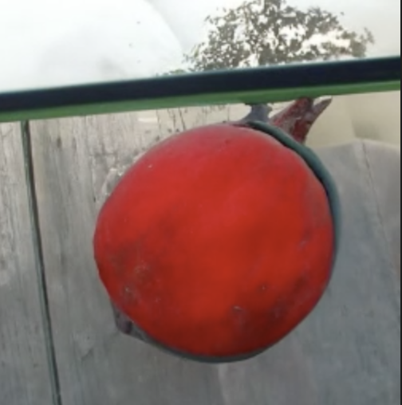
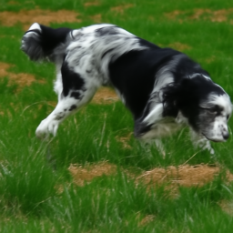
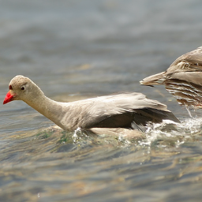
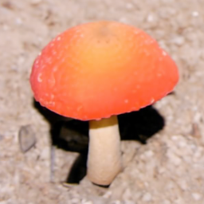

# CLIP Guided Diffusion
From [RiversHaveWings](https://twitter.com/RiversHaveWings).

Generate vibrant and detailed images using only text.

<a href="https://colab.research.google.com/github/afiaka87/clip-guided-diffusion/blob/main/cgd.ipynb">  </a>

</img></img></img>
</img></img></img>

See captions and more generations in the [Gallery](/images/README.md)

See also - <a href="https://github.com/nerdyrodent/VQGAN-CLIP">VQGAN-CLIP</a>

---

## Installation
```sh
git clone https://github.com/afiaka87/clip-guided-diffusion.git
cd clip-guided-diffusion
python3 -m venv cgd_venv
source cgd_venv/bin/activate
❯ (cgd_venv) pip install -r requirements.txt
❯ (cgd_venv) git clone https://github.com/afiaka87/guided-diffusion.git
❯ (cgd_venv) pip install -e guided-diffusion
```
## Usage - Python

```python
# Initialize diffusion generator
from cgd import clip_guided_diffusion
import cgd_util
import kornia.augmentation as K

prompt = "An image of a fox in a forest."

# Pass in your own augmentations (supports torchvision.transforms/kornia.augmentation)
# (defaults to no augmentations, which is likely best unless you're doing something special)
aug_list = [
    K.RandomAffine(degrees=0, translate=(0.1, 0.1), scale=(0.9, 1.1), shear=0.1)),
    K.RandomMotionBlur(kernel_size=(1, 5), angle=15, direction=0.5)),
    K.RandomHorizontalFlip(p=0.5)),
]

# Remove non-alphanumeric and white space characters from prompt and prompt_min for directory name
outputs_path = cgd_util.txt_to_dir(base_path=prefix_path, txt=prompt)
outputs_path.mkdir(exist_ok=True)

# `cgd_samples` is a generator that yields the output images
cgd_samples, _, diffusion = clip_guided_diffusion(prompt=prompt, prefix=outputs_path, augs=aug_list)

# Image paths will all be in `all_images` for e.g. video generation at the end.
all_images = []
current_timestep = diffusion.num_timesteps - 1
for step, sample in enumerate(cgd_samples):
    current_timestep -= 1
    if step % save_frequency == 0 or current_timestep == -1:
        for j, image in enumerate(sample["pred_xstart"]): # j is the index of the batch
            image_path = Path(log_image(image, prefix_path, step, j))
            print(f"Saved {image_path}")
            all_images.append(image_path)
```
- Respective guided-diffusion checkpoints from OpenAI will be downloaded to `~/.cache/clip-guided-diffusion/` by default.
- The file `current.png` can be refreshed to see the current image.

## Usage - CLI
### Text to image generation

`--prompt` / `-txt`
`--image_size` / `-size`
- Filename format `f"{caption}/batch_idx_{j}_iteration_{i}.png"`
- The most recent generation will also be stored in the file `current.png`

```sh
❯ (cgd_venv) python cgd.py -size 256 -txt "32K HUHD Mushroom"
Step 999, output 0:
00%|███████████████| 1000/1000 [00:00<12:30,  1.02it/s]
```


### CLIP Class Scoring
- `--class_score` / `-score`
- Scores are used to weight class selection.
```sh
❯ (cgd_venv) python cgd.py -score -cgs 200 -cutn 64 -size 256 -respace 'ddim100' --prompt "cat painting"
```

### Iterations/Steps (Timestep Respacing)
- `--diffusion_steps`, `-steps` (default: `1000`)
  - `25`, `50`, `150`, `250`, `500`, `1000`,
  - **The default of `1000` is the most accurate and is recommended.**
- `--timestep_respacing` or `-respace`  (default: `1000`)
  - Use fewer timesteps over the same diffusion schedule. 
    - e.g. `-respace "ddim25"`
  - `options`: 
    - `25`, `50`, `150`, `250`, `500`, `1000`,
    - `ddim25`,`ddim50`,`ddim150`, `ddim250`,`ddim500`,`ddim1000`
```sh
❯ (cgd_venv) python cgd.py -respace 'ddim50' -txt "cat painting"
```
- Smaller `-respace` values can benefit a lot from class scoring.
```sh
❯ (cgd_venv) python cgd.py -score -respace 50 -txt "cat painting"
```

### Penalize a text prompt as well
- `--prompt_min`/`-min`
- Loss for prompt_min is weighted 0.5, a value found in experimentation.
- Also used to weight class selection with `-score`.
```sh
❯ (cgd_venv) python cgd.py -txt "32K HUHD Mushroom" -min "green grass"
```
</img>

### Existing image 
- `--init_image`/`-init` and  `--skip_timesteps`/`-skip`
Blend an image with the diffusion for a number of steps. 
- `--skip_timesteps`/`-skip` is the number of timesteps to spend blending.
  - **Needs to be set in order to blend an image.**
  - Good range for `-respace=1000` is 350 to 650.
```sh
❯ (cgd_venv) python cgd.py \
  -init "images/32K_HUHD_Mushroom.png" \
  -skip 500 \
  -txt "A mushroom in the style of Vincent Van Gogh"
```
</img>

### Image size
- Default is 128px
- Available image sizes are `64, 128, 256, 512 pixels (square)`
- The 512x512 pixel checkpoint **requires a GPU with at least 12GB of VRAM.**
- `--clip_guidance_scale` and `--tv_scale` will require experimentation.
- the 64x64 diffusion checkpoint is challenging to work with and often results in an all-white or all-black image.
  - This is much less of an issue when using an existing image of some sort.
```sh
❯ (cgd_venv) python cgd.py \
    --init_image=images/32K_HUHD_Mushroom.png \
    --skip_timesteps=500 \
    --image_size 64 \
    --prompt "8K HUHD Mushroom"
```
</img>

```sh
❯ (cgd_venv) $ python cgd.py --image_size 512 --prompt "8K HUHD Mushroom"
```
</img>

## Full Usage:
```sh
-h, --help            show this help message and exit
--prompt PROMPT, -txt PROMPT
                      the prompt to reward (default: )
--prompt_min PROMPT_MIN, -min PROMPT_MIN
                      the prompt to penalize (default: None)
--min_weight MIN_WEIGHT, -min_wt MIN_WEIGHT
                      the prompt to penalize (default: 0.1)
--image_size IMAGE_SIZE, -size IMAGE_SIZE
                      Diffusion image size. Must be one of [64, 128, 256, 512]. (default: 128)
--init_image INIT_IMAGE, -init INIT_IMAGE
                      Blend an image with diffusion for n steps (default: None)
--skip_timesteps SKIP_TIMESTEPS, -skip SKIP_TIMESTEPS
                      Number of timesteps to blend image for. CLIP guidance occurs after this. (default: 0)
--prefix PREFIX, -dir PREFIX
                      output directory (default: outputs)
--checkpoints_dir CHECKPOINTS_DIR, -ckpts CHECKPOINTS_DIR
                      Path subdirectory containing checkpoints. (default: checkpoints)
--batch_size BATCH_SIZE, -bs BATCH_SIZE
                      the batch size (default: 1)
--clip_guidance_scale CLIP_GUIDANCE_SCALE, -cgs CLIP_GUIDANCE_SCALE
                      Scale for CLIP spherical distance loss. Values will need tinkering for different settings. (default: 1000)
--tv_scale TV_SCALE, -tvs TV_SCALE
                      Scale for denoising loss (default: 100)
--class_score, -score
                      Enables CLIP guided class randomization. (default: False)
--top_n TOP_N, -top TOP_N
                      Top n imagenet classes compared to phrase by CLIP (default: 1000)
--seed SEED, -seed SEED
                      Random number seed (default: 0)
--save_frequency SAVE_FREQUENCY, -freq SAVE_FREQUENCY
                      Save frequency (default: 5)
--device DEVICE       device to run on .e.g. cuda:0 or cpu (default: None)
--diffusion_steps DIFFUSION_STEPS, -steps DIFFUSION_STEPS
                      Diffusion steps (default: 1000) --timestep_respacing TIMESTEP_RESPACING, -respace TIMESTEP_RESPACING
                      Timestep respacing (default: 1000)
--num_cutouts NUM_CUTOUTS, -cutn NUM_CUTOUTS
                      Number of randomly cut patches to distort from diffusion. (default: 32)
--cutout_power CUTOUT_POWER, -cutpow CUTOUT_POWER
                      Cutout size power (default: 0.5)
--clip_model CLIP_MODEL, -clip CLIP_MODEL
                      clip model name. Should be one of: ('ViT-B/16', 'ViT-B/32', 'RN50', 'RN101', 'RN50x4', 'RN50x16') (default: ViT-B/32)
--class_cond CLASS_COND, -cond CLASS_COND
                      Use class conditional. Required for image sizes other than 256 (default: True)
```

> This code is currently under active development and is subject to frequent changes. Please file an issue if you have any constructive feedback, questions, or issues with the code or colab notebook.